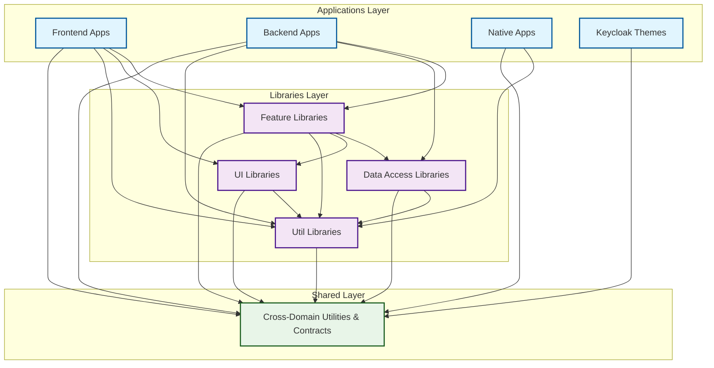

# AI-Driven Development Framework

> **Streamline AI-powered development workflows and accelerate prototyping for SMBs and enterprises**

[](LICENSE)
[](https://nx.dev)
[](https://www.cursor.so)
[](https://www.typescriptlang.org/)
[](https://angular.io)
[](https://nestjs.com/)

## 🎯 Why This Framework Exists

Modern software development is evolving rapidly. AI agents are becoming powerful development partners, but they need **structure, guidance, and the right tools** to be truly effective. This framework bridges this gap by providing:

- **🧠 Intelligent Guidelines** - Comprehensive rules and patterns that guide AI agents to produce consistent, high-quality code
- **⚡ Streamlined Workflows** - Optimized development processes that accelerate prototyping and reduce time-to-market
- **🏗️ Enterprise-Ready Architecture** - Scalable monorepo patterns that work for both startups and large organizations
- **🛠️ Integrated Tooling** - Seamless integration with modern development tools and AI-powered assistants

Whether you're a **small business** looking to prototype quickly or an **enterprise** managing complex codebases, this framework provides the structure to make AI-driven development predictable, scalable, and maintainable.

## 🚀 What This Framework Provides

### For Development Teams

- **📋 Comprehensive Guidelines** - Clear rules for code organization, naming conventions, and architectural patterns
- **🔄 Optimized Workflows** - Streamlined processes from planning to deployment
- **🎯 Quality Assurance** - Built-in validation, testing, and formatting pipelines
- **📚 Extensive Documentation** - Human-readable guides alongside technical specifications

### For AI Agents

- **🤖 Structured Behavior** - Detailed rules that guide AI agents to produce consistent results
- **🔧 Tool Integration** - Seamless access to development tools and workspace insights
- **📊 Context Awareness** - Rich understanding of project structure and dependencies
- **⚙️ Automated Workflows** - Intelligent handling of common development tasks

### For Organizations

- **📈 Accelerated Development** - Faster prototyping and feature delivery
- **🎯 Consistent Quality** - Standardized patterns across teams and projects
- **🔒 Enterprise Security** - Built-in best practices for secure development
- **📊 Scalable Architecture** - Patterns that grow with your organization

## 🏗️ Architecture Overview

This framework is built around **domain-driven design** principles with clear separation of concerns:



## 🛠️ Key Features

### 🎯 **Intelligent Operation Modes**

- **Plan-First Mode** - For analysis, investigation, and strategic planning
- **Immediate Implementation Mode** - For direct fixes and feature development
- **Mixed-Mode Support** - Seamless handling of complex, multi-phase tasks

### 🔧 **Integrated Tooling**

- **Nx Monorepo Management** - Smart task execution and dependency management
- **MCP Server Integration** - AI agents with workspace insights and GitHub automation
- **Automated Quality Gates** - Formatting, linting, testing, and validation pipelines
- **GitHub Workflow Automation** - Streamlined issue handling and PR processes

### 📚 **Comprehensive Documentation**

- **Human-Readable Guides** - Clear explanations with examples and context
- **Technical Specifications** - Detailed rules for AI agents and automated systems
- **Quick Reference Materials** - Commands, troubleshooting, and best practices
- **Architecture Documentation** - Structural patterns and organizational principles

### 🏢 **Enterprise-Ready Patterns**

- **Domain-Driven Design** - Clear business context boundaries
- **Dependency Management** - Controlled, predictable component interactions
- **Scalable Architecture** - Patterns that grow with your organization
- **Security Best Practices** - Built-in guidelines for secure development

## 🚀 Quick Start

### Prerequisites

- [Node.js](https://nodejs.org/) (v18 or higher)
- [Node Version Manager](https://github.com/nvm-sh/nvm) (for runtime selection)
- [Docker](https://docs.docker.com/get-docker/) (for MCP servers)
- [Git](https://git-scm.com/) (for version control)

### Installation

```bash
# Clone the repository
git clone <repository-url>
cd devkit

# Select the correct NodeJS version
nvm use

# Install dependencies
npm install

# Verify installation
nx --version
```

### First Steps

1. **📖 Read the Documentation**

   ```bash
   # Start with the getting started guide
   open docs/development-workflows/getting-started.md
   ```

2. **🔧 Set Up Your Environment**

   ```bash
   # Configure MCP servers (see docs/tools/)
   # Set up environment variables
   # Verify tooling integration
   ```

3. **🎯 Choose Your Workflow**

   ```bash
   # For analysis and planning
   # Use Plan-First Mode (see docs/development-workflows/operation-modes.md)

   # For direct implementation
   # Use Immediate Implementation Mode
   ```

4. **✅ Validate Your Setup**
   ```bash
   # Run the validation pipeline
   nx prepush
   ```

## 📖 Documentation

### 🚀 **Development Workflows**

- [Getting Started](./docs/development-workflows/getting-started.md) - Your first steps in the framework
- [Operation Modes](./docs/development-workflows/operation-modes.md) - Understanding different approaches to tasks
- [GitHub Workflow](./docs/development-workflows/github-workflow.md) - Issue handling and PR processes
- [Validation Pipeline](./docs/development-workflows/validation-pipeline.md) - Quality assurance and testing

### 🏗️ **Architecture**

- [Monorepo Structure](./docs/architecture/monorepo-structure.md) - High-level organization and principles

### ✨ **Best Practices**

- [Code Quality](./docs/best-practices/code-quality.md) - Writing maintainable, high-quality code

### 🛠️ **Tools & Integration**

- [Development Tools](./docs/tools/README.md) - MCP servers, automation, and integrations
- [GitHub Integration](./docs/tools/github-mcp-setup.md) - GitHub workflow automation
- [Framework MCP Server](./docs/tools/devkit/mcp-proxy-architecture.md) - Workspace insights and diagnostics

### 📖 **Reference**

- [Quick Commands](./docs/reference/quick-commands.md) - Essential daily commands
- [Rule Index](./docs/reference/rule-index.md) - Complete reference to all guidelines
- [Troubleshooting](./docs/reference/troubleshooting.md) - Common issues and solutions

## 🎯 Use Cases

### 🏢 **Small to Medium Businesses (SMBs)**

- **Rapid Prototyping** - Quickly validate ideas and build MVPs
- **Cost-Effective Development** - Maximize productivity with limited resources
- **Scalable Growth** - Start small, grow systematically
- **Quality Assurance** - Maintain high standards without large teams

### 🏭 **Enterprises**

- **Team Coordination** - Consistent patterns across large development teams
- **Complex Architecture** - Manage sophisticated, multi-domain systems
- **Compliance & Security** - Built-in best practices for regulated industries
- **Knowledge Management** - Preserve institutional knowledge and best practices

### 🤖 **AI-Driven Development**

- **Agent Guidance** - Clear rules and patterns for AI development partners
- **Consistent Output** - Predictable, high-quality code generation
- **Context Awareness** - Rich understanding of project structure and requirements
- **Automated Workflows** - Intelligent handling of routine development tasks

## 🌟 Why Choose This Framework?

### 🎯 **Proven Patterns**

Built on years of experience with monorepo management, domain-driven design, and AI-assisted development.

### ⚡ **Developer Experience**

Optimized workflows that reduce cognitive load and accelerate development cycles.

### 🔧 **Integrated Tooling**

Seamless integration with modern development tools and AI-powered assistants.

### 📈 **Scalable Architecture**

Patterns that work for small teams and scale to enterprise-level organizations.

### 🛡️ **Quality Assurance**

Built-in validation, testing, and quality gates that ensure consistent, maintainable code.

## 🤝 Contributing

We welcome contributions! Whether you're fixing bugs, adding features, or improving documentation, your input helps make this framework better for everyone.

For detailed information on how to contribute, please see our [Contributing Guide](./CONTRIBUTING.md).

## 🔒 Security

We take security seriously. If you discover a security vulnerability, please report it responsibly.

- **Security Issues**: Report vulnerabilities to soc@forepath.io
- **Security Policy**: See our [Security Policy](./SECURITY.md) for detailed information
- **Response Time**: We aim to respond to security reports within 48 hours

## 📄 License

This project is licensed under the MIT License - see the [LICENSE](./LICENSE) file for details.

## 🙏 Acknowledgments

- Built with [Nx](https://nx.dev) - The smart, fast and extensible build system
- Powered by modern development tools and AI technologies
- Inspired by domain-driven design and clean architecture principles

---

## 🚀 Ready to Transform Your Development Workflow?

This isn't just another framework—it's a complete ecosystem designed to make AI-driven development predictable, scalable, and enjoyable. Whether you're building your first prototype or managing enterprise-scale applications, this framework provides the structure and tools you need to succeed.

**Start your journey today:**

```bash
git clone <repository-url>
cd devkit
nvm use
npm install
```

Then dive into our [Getting Started Guide](./docs/development-workflows/getting-started.md) and discover how this framework can transform your development workflow.

---

_Built with ❤️ for developers who want to build better software, faster._
