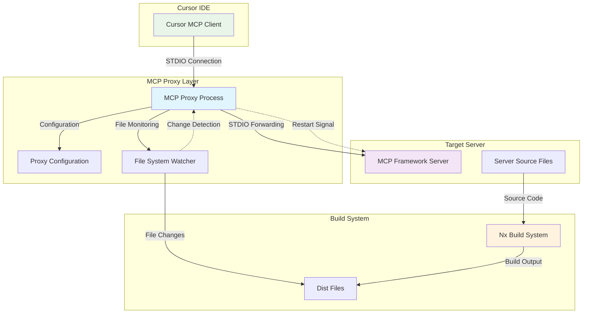
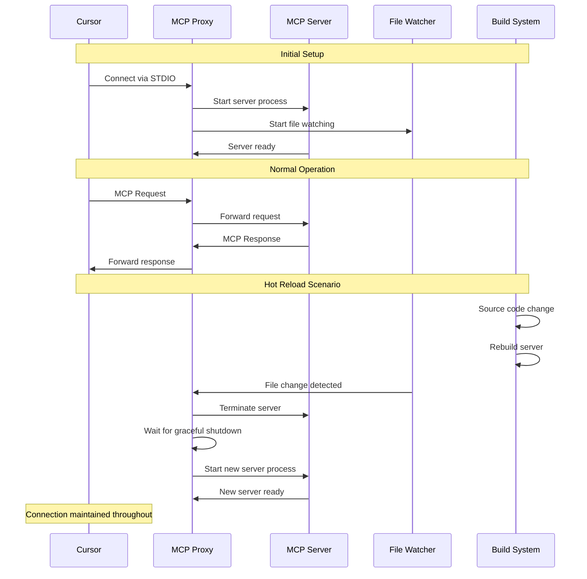

# MCP Proxy Architecture

The MCP Proxy is a solution to maintain persistent connections to MCP (Model Context Protocol) servers during development hot-reloads. It acts as an STDIO proxy that keeps the connection alive while the actual server component can be restarted in the background.

## Problem Statement

When developing MCP servers with hot-reload capabilities, the connection to the MCP server is lost every time the application is rebuilt. This interrupts the development workflow and requires manual reconnection to the MCP server.

## Solution Architecture

The MCP Proxy creates a persistent STDIO connection that acts as a bridge between the MCP client (Cursor) and the actual MCP server. The proxy maintains the connection while managing the lifecycle of the target server process.

## Architecture Diagram



## Components

### 1. MCP Proxy Process

- **Purpose**: Maintains persistent STDIO connection to Cursor
- **Responsibilities**:
  - Forward STDIO streams between Cursor and target server
  - Manage target server process lifecycle
  - Handle graceful shutdowns and restarts
  - Monitor file system changes

### 2. Target Server (MCP Framework)

- **Purpose**: The actual MCP server providing functionality
- **Responsibilities**:
  - Implement MCP protocol handlers
  - Provide tools and resources
  - Handle MCP requests and responses

### 3. File System Watcher

- **Purpose**: Monitor build output for changes
- **Responsibilities**:
  - Watch `dist/apps/mcp-devkit/` directory
  - Trigger server restarts on file changes
  - Filter relevant file types (.js, .json)

### 4. Build System Integration

- **Purpose**: Rebuild server when source changes
- **Responsibilities**:
  - Compile TypeScript to JavaScript
  - Generate distribution files
  - Trigger file system events

## Data Flow



## Configuration

### Proxy Configuration

The proxy can be configured via environment variables or uses sensible defaults:

```typescript
const config: ProxyConfig = {
  targetCommand: 'node',
  targetArgs: [getTargetPath()], // Resolved from MCP_DEVKIT_PATH env var or default
  restartDelay: 1000, // 1 second delay between restarts
  maxRestartAttempts: 10,
};
```

#### Environment Variables

- **`MCP_DEVKIT_PATH`**: Override the path to the MCP devkit server
  - If not set, defaults to `dist/apps/mcp-devkit/main.js`
  - Can be relative (to current working directory) or absolute
  - Examples:
    - `MCP_DEVKIT_PATH=dist/apps/mcp-devkit/main.js` (default)
    - `MCP_DEVKIT_PATH=/absolute/path/to/server.js`
    - `MCP_DEVKIT_PATH=./custom/path/server.js`

### MCP Client Configuration (.cursor/mcp.json)

```json
{
  "mcpServers": {
    "devkit": {
      "command": "node",
      "args": ["dist/apps/mcp-proxy/main.js"]
    }
  }
}
```

## Key Features

### 1. Persistent Connection

- The proxy maintains a single STDIO connection to Cursor
- Target server can be restarted without losing the connection
- Seamless experience for the developer

### 2. Automatic Restart

- File system watcher detects build output changes
- Automatic restart of target server process
- Configurable restart delay and retry limits

### 3. Graceful Shutdown

- Proper cleanup of child processes
- Signal handling for graceful termination
- Timeout-based force kill as fallback

### 4. Error Handling

- Robust error handling for process failures
- Automatic retry with exponential backoff
- Maximum restart attempt limits

### 5. Development-Friendly

- All proxy messages logged to stderr (won't interfere with MCP protocol)
- Clear logging of proxy operations
- Easy debugging and monitoring

## Usage

### Development Workflow

1. **Start Development Server**:

   ```bash
   npx nx serve mcp-devkit
   ```

2. **Build Proxy** (one-time setup):

   ```bash
   npx nx build mcp-proxy
   ```

3. **Cursor Connection**:
   - Cursor connects to the proxy via STDIO
   - Proxy forwards all communication to the devkit server
   - File changes trigger automatic server restarts

#### Using Custom Paths

To use a custom path for the MCP devkit server, set the `MCP_DEVKIT_PATH` environment variable:

```bash
# Using a custom relative path
MCP_DEVKIT_PATH=./custom/path/to/server.js node dist/apps/mcp-proxy/main.js

# Using an absolute path
MCP_DEVKIT_PATH=/home/user/projects/my-mcp-server/dist/main.js node dist/apps/mcp-proxy/main.js

# Or export it for the session
export MCP_DEVKIT_PATH=dist/apps/mcp-devkit/main.js
node dist/apps/mcp-proxy/main.js
```

The file watcher will automatically adapt to watch the correct directory based on the configured path.

### Production Deployment

For production, you can either:

- Use the proxy for additional reliability
- Connect directly to the server (bypassing proxy)

## Benefits

1. **Uninterrupted Development**: No connection drops during hot reloads
2. **Transparent Operation**: Works with existing MCP clients without changes
3. **Robust Error Handling**: Automatic recovery from server failures
4. **Development Efficiency**: Faster iteration cycles
5. **Production Ready**: Can be used in production for additional reliability

## Implementation Details

### STDIO Stream Handling

- `stdin`: Forwarded from proxy to target server
- `stdout`: Forwarded from target server to proxy to Cursor
- `stderr`: Proxy logs to stderr, target server stderr forwarded

### Process Management

- Child process spawning with proper stdio configuration
- Signal handling for graceful shutdown
- Process monitoring and restart logic

### File Watching

- Native Node.js `fs.watch` for cross-platform compatibility
- Recursive directory watching
- File type filtering for relevant changes

## Troubleshooting

### Common Issues

1. **Connection Lost**: Check if proxy process is running
2. **Restart Loops**: Verify build output is stable
3. **Permission Issues**: Ensure proper file system permissions
4. **Port Conflicts**: Verify no other processes using STDIO

### Debugging

Enable debug logging by checking stderr output:

```bash
node dist/apps/mcp-proxy/main.js 2> proxy.log
```
